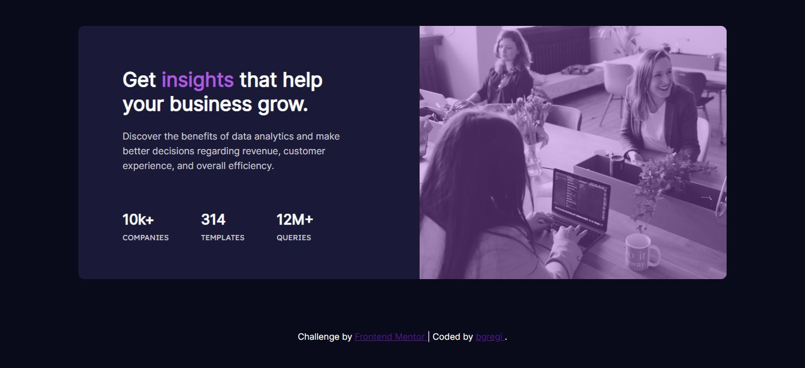

# Frontend Mentor - Stats preview card component solution

This is a solution to the [Stats preview card component challenge on Frontend Mentor](https://www.frontendmentor.io/challenges/stats-preview-card-component-8JqbgoU62). Frontend Mentor challenges help you improve your coding skills by building realistic projects. 

## Table of contents

- [Overview](#overview)
  - [The challenge](#the-challenge)
  - [Screenshot](#screenshot)
  - [Links](#links)
- [My process](#my-process)
  - [Built with](#built-with)
  - [What I learned](#what-i-learned)
- [Author](#author)

## Overview

### The challenge

Users should be able to:

- View the optimal layout depending on their device's screen size

### Screenshot

### Links

- Solution URL: [https://github.com/bgregi/fm-stats-preview-card](https://github.com/bgregi/fm-stats-preview-card)
- Live Site URL: [https://bgregi.github.io/fm-stats-preview-card](https://bgregi.github.io/fm-stats-preview-card)

## My process

### Built with

- Semantic HTML5 markup
- CSS custom properties
- Flexbox

### What I learned

This challenge has contributed a lot to my CSS knowledge, especially using the Flexbox model. I also had to research about responsive layouts for mobile and desktop. I ended up using the "desktop first" approach, but, as I learned, it's much more efficient to use the "mobile first" approach.

As this is my first "real" challenge in coding (I have been only studying through online classes and doing the exercises along with the teachers), I think I've learned many valuable lessons that are going to be of great use in the next challenges.

## Author

- Website - [bgregi's GitHub Profile](https://github.com/bgregi)
- Frontend Mentor - [@bgregi](https://www.frontendmentor.io/profile/bgregi)